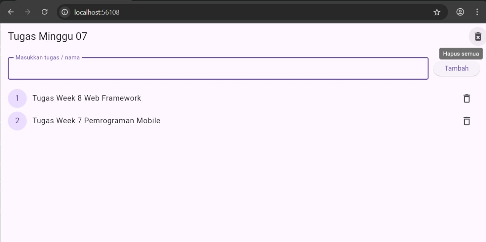

# tugas_minggu07

A new Flutter project.

# 📝 Aplikasi To-Do List Flutter

Proyek sederhana ini dibuat menggunakan **Flutter** dengan bantuan **Provider** sebagai state management.  
Aplikasi ini berfungsi untuk menambahkan, menampilkan, dan menghapus daftar tugas secara real-time.

---

## 👤 Identitas Pembuat

**Nama:** Fadillah Dani Prawoto  
**NIM:** 2310130004  
**Jurusan:** Ilmu Komputer  

---

## 📁 Struktur Folder

lib/
├─ main.dart
├─ home_page.dart
└─ task_provider.dart


---

## ⚙️ Cara Menjalankan

1. Pastikan sudah menginstal **Flutter SDK** dan **Android Studio / VS Code**.
2. Clone repository ini ke lokal:

   ```bash
   git clone https://github.com/username/nama-repo.git
3. Masuk ke folder proyek:
cd nama-repo

4. Jalankan perintah untuk mengambil dependency:
flutter pub get

5. Jalankan aplikasi:
flutter run


**Dependensi yang Digunakan**

Flutter SDK

Provider (^6.1.2)

Pastikan pubspec.yaml memiliki bagian berikut:

dependencies:
  flutter:
    sdk: flutter
  provider: ^6.1.2

## 📸 Tampilan Aplikasi

Berikut tampilan aplikasi To-Do List 👇

  |


